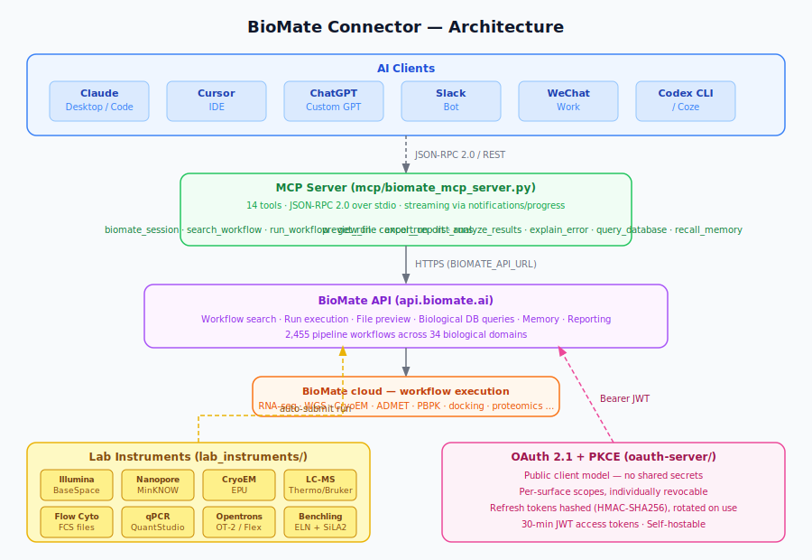
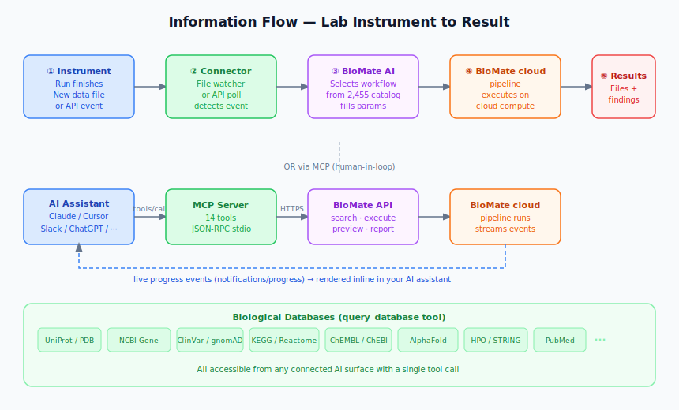

# BioMate Connector

Connect BioMate to the AI tools you already use — Claude Code, Claude Desktop, Cursor, Codex, ChatGPT, Slack, and WeChat — and run real bioinformatics pipelines without leaving your chat window. Also connect your lab instruments (Illumina, Nanopore, CryoEM, LC-MS, and more) so data flows automatically into the right pipeline the moment a run finishes.

```
> Screen aspirin and caffeine for hERG inhibition and CYP3A4 metabolism.
> Run RNA-seq differential expression on s3://my-bucket/fastqs/, treated vs control.
> Refine this cryo-EM stack with CryoSPARC homogeneous refinement, C2 symmetry.
```

BioMate finds the right pipeline from 2,455 indexed workflows, fills the parameters, launches on BioMate cloud, and streams live progress back to your assistant. No copy-pasting commands. No waiting for a dashboard to refresh.

## Architecture



## Information Flow



---

## Get started in 30 seconds

```bash
npx @biomate/connect claude-code
```

Pick your surface, authenticate once via your browser, and you're done. The CLI writes the MCP config for you and stores your token in the OS keychain.

| Surface | Command |
|---|---|
| Claude Code | `npx @biomate/connect claude-code` |
| Claude Desktop | `npx @biomate/connect claude-desktop` |
| Cursor | `npx @biomate/connect cursor` |
| Codex CLI | `npx @biomate/connect codex` |
| ChatGPT | See [`connectors/chatgpt/INSTALL.md`](connectors/chatgpt/INSTALL.md) |
| Slack | See [`connectors/slack/README.md`](connectors/slack/README.md) |
| WeChat / Open Claw | `npx @biomate/connect open-claw` |

---

## What's in this repo

```
connectors/        Per-surface install guides, MCP config snippets, and the @biomate/connect CLI
lab_instruments/   Lab instrument connectors (Illumina, Nanopore, CryoEM, LC-MS, and 6 more)
oauth-server/      OAuth 2.1 + PKCE authorization server (self-hostable)
mcp/               Shared MCP tools manifest and server — the single source of truth for all surfaces
skills/biomate/    Claude Skill bundle for the Anthropic Skills gallery
tests/             Connector test suites (offline sandbox + live API + 68 lab instrument checks)
```

---

## Lab Instrument Connectors

Connect physical instruments so raw data is routed automatically to the right BioMate workflow the moment a run finishes — no manual upload, no copy-pasting paths.

| Instrument | File | Trigger |
|-----------|------|---------|
| **Illumina BaseSpace** | `lab_instruments/illumina_basespace_connector.py` | New run via BaseSpace API |
| **Oxford Nanopore MinKNOW** | `lab_instruments/nanopore_minknow_connector.py` | Run complete via MinKNOW HTTP API |
| **CryoEM EPU** | `lab_instruments/cryoem_instrument_connector.py` | New `.mrc`/`.mrcs` micrographs in output dir |
| **LC-MS** | `lab_instruments/lcms_connector.py` | New `.raw`/`.d`/`.wiff` files (Thermo, Bruker, Waters, SCIEX) |
| **Flow Cytometer** | `lab_instruments/flow_cytometer_connector.py` | New `.fcs` files (BD, Beckman, Sony) |
| **qPCR** | `lab_instruments/qpcr_connector.py` | New `.eds` (QuantStudio) or `.pcrd` (Bio-Rad CFX) |
| **Plate Reader** | `lab_instruments/plate_reader_connector.py` | New `.xlsx` exports (BioTek, Molecular Devices) |
| **Opentrons OT-2/Flex** | `lab_instruments/opentrons_connector.py` | Protocol complete via robot HTTP API |
| **Benchling ELN** | `lab_instruments/benchling_connector.py` | New entry or assay result via Benchling API |
| **SiLA2 devices** | `lab_instruments/sila2_adapter.py` | gRPC events (Hamilton, Sartorius, etc.) |

Quick start — copy `config.example.yaml` (in `lab_instruments/`), fill in your instrument details, and run:

```bash
pip install -r requirements.txt
python3 lab_instruments/instrument_watcher.py --config config.yaml
```

---

## The tools your assistant gets

Once connected, your AI assistant can call 14 BioMate tools:

**`biomate_session`** — the main one. Describe your goal in plain language; BioMate orchestrates the rest and streams progress back as it runs.

Beyond that, workflow primitives (`search_workflow`, `run_workflow`, `get_run`, `cancel_run`) and output tools (`preview_file`, `export_report`, `analyze_results`, `query_database`) give you fine-grained control when you need it.

See [`connectors/README.md`](connectors/README.md) for the full tool reference.

---

## Self-hosting the OAuth server

If you're integrating BioMate into your own infrastructure, the OAuth 2.1 + PKCE server in `oauth-server/` is self-contained and runnable independently.

```bash
pip install -r requirements.txt
python -m oauth-server
```

See [`oauth-server/oauth/server.py`](oauth-server/oauth/server.py) for configuration options.

---

## Security

- OAuth 2.1 + PKCE — no shared secrets, no passwords stored
- Per-surface scope grants, individually revocable at [biomate.ai/account/connectors](https://biomate.ai/account/connectors)
- Refresh tokens hashed at rest (HMAC-SHA256) and rotated on every use
- 30-minute JWT access tokens

---

## License

MIT — for the connector code in this repository. BioMate platform usage is governed by [biomate.ai/terms](https://biomate.ai/terms).

Questions? [support@biomate.ai](mailto:support@biomate.ai)
